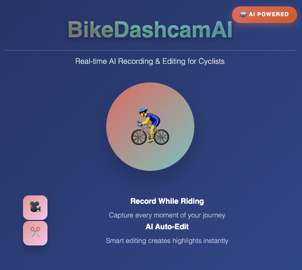

# BikeDashcamAI - Intelligent Dashcam with Real-time AI Editing

An iOS dashcam application with AI-powered real-time video editing capabilities that automatically identifies and clips exciting moments during recording.

<div align="center">



*Experience the future of cycling with AI-powered video recording and editing*
 
</div>

---

## Core Features

### 🎥 Real-time Video Recording
- High-definition video recording (1080p)
- Live camera preview
- Synchronized audio recording

### 🤖 AI-Powered Analysis
- **Motion Detection**: Identifies movement changes in the frame
- **Object Detection**: Detects vehicles, pedestrians, traffic signs, etc.
- **Scene Analysis**: Analyzes brightness, contrast, and composition
- **Action Recognition**: Recognizes specific actions and events

### ✂️ Real-time AI Editing
- Analysis during recording
- Automatic identification of exciting moments
- Real-time video segment generation
- Intelligent editing algorithms

### 🎬 Smart Composition
- Automatic splicing of exciting segments
- Maintains video fluidity
- High-quality output

## Technical Architecture

### Core Components

1. **VideoCaptureManager** - Video Capture Management
   - AVCaptureSession configuration
   - Real-time frame processing
   - Permission management

2. **AIAnalyzer** - AI Analysis Engine
   - Motion detection algorithms
   - Object recognition
   - Scene analysis
   - Action recognition

3. **VideoProcessor** - Video Processor
   - Real-time segment management
   - Video composition
   - Export processing

4. **ContentView** - User Interface
   - SwiftUI interface
   - Real-time status display
   - User interaction

### AI Analysis Algorithms

#### Motion Detection
```swift
// Frame difference-based motion detection
private func calculateMotionLevel(current: CVPixelBuffer, previous: CVPixelBuffer) -> Float
```

#### Scene Analysis
```swift
// Brightness and contrast analysis
private func calculateBrightness(_ pixelBuffer: CVPixelBuffer) -> Float
```

#### Intelligent Editing
```swift
// Confidence-based segment selection
private func shouldIncludeFrame(_ analysisResult: VideoAnalysisResult) -> Bool
```

## Installation and Setup

### System Requirements
- iOS 17.0+
- Xcode 15.0+
- Device supporting AVFoundation

### Installation Steps

1. Clone the repository
```bash
git clone https://github.com/yourusername/BikeDashcamAI.git
cd BikeDashcamAI
```

2. Open the Xcode project
```bash
open BikeDashcamAI.xcodeproj
```

3. Configure developer account
   - Select your developer account in Xcode
   - Update Bundle Identifier

4. Run the project
   - Select target device
   - Click the run button

### Permission Configuration

The app requires the following permissions:
- **Camera Permission**: For video recording
- **Microphone Permission**: For audio recording

Permissions are configured in Info.plist.

## Usage Guide

### Basic Operations

1. **Start Recording**
   - Tap the red record button to start filming
   - The app will automatically begin AI analysis

2. **Real-time Editing**
   - AI automatically identifies exciting moments during recording
   - Status bar displays current segment count

3. **Complete Recording**
   - Tap the record button again to stop filming
   - AI automatically processes and generates the final video

4. **View Results**
   - Tap the play button to view the edited video
   - Video is saved locally on the device

### Interface Description

- **Top Status Bar**: Shows recording status, AI processing progress, segment count
- **Record Button**: Start/stop recording
- **Settings Button**: App settings (to be implemented)
- **Play Button**: View final video

## Technical Highlights

### Real-time Processing
- Multi-threaded processing to avoid UI lag
- Intelligent cache management for optimized memory usage
- Asynchronous AI analysis for improved responsiveness

### Smart Algorithms
- Multi-dimensional analysis: motion, objects, scenes, actions
- Adaptive thresholds: dynamically adjust based on content
- Confidence weighting: make decisions based on multiple factors

### Performance Optimization
- Frame sampling: only analyze key frames for better performance
- Memory management: timely release of unnecessary frames
- Background processing: AI analysis runs on background threads

## Key Features

### Real-time AI Analysis
The app performs continuous analysis of video frames using multiple AI algorithms:

- **Motion Detection**: Uses frame difference analysis to detect significant movement
- **Scene Analysis**: Evaluates brightness, contrast, and visual appeal
- **Object Recognition**: Identifies interesting objects in the scene
- **Action Recognition**: Detects specific actions or events

### Intelligent Video Editing
- Automatically selects the most interesting segments based on AI analysis
- Maintains smooth transitions between segments
- Optimizes video length while preserving quality

### User Experience
- Clean, intuitive interface designed for one-handed operation
- Real-time feedback on recording and processing status
- Immediate access to edited videos

## Development

### Project Structure
```
BikeDashcamAI/
├── AppDelegate.swift          # Application lifecycle
├── SceneDelegate.swift        # Scene management
├── ContentView.swift          # Main UI interface
├── VideoCaptureManager.swift  # Video capture and processing
├── AIAnalyzer.swift          # AI analysis engine
├── VideoProcessor.swift      # Video editing and composition
└── Assets.xcassets/          # App resources
```

### Key Classes

#### VideoCaptureManager
- Manages AVCaptureSession for video recording
- Handles real-time frame processing
- Coordinates with AI analysis

#### AIAnalyzer
- Contains multiple detection algorithms
- Processes frames asynchronously
- Provides confidence scores for editing decisions

#### VideoProcessor
- Manages video segments in real-time
- Handles video composition and export
- Provides progress updates

## Future Enhancements

### Planned Features
- [ ] Custom AI model support
- [ ] Cloud-based AI analysis
- [ ] Social sharing capabilities
- [ ] Advanced video editing tools
- [ ] Multi-camera support
- [ ] GPS integration for location-based editing

### Customization Options
- [ ] Adjustable editing parameters
- [ ] AI sensitivity settings
- [ ] Output quality selection
- [ ] Storage management
- [ ] Custom editing presets

## Performance Considerations

### Memory Management
- Efficient frame buffer management
- Automatic cleanup of old frames
- Optimized for mobile device constraints

### Battery Optimization
- Background processing optimization
- Efficient AI algorithm implementation
- Smart power management

### Storage Optimization
- Compressed video storage
- Automatic cleanup of temporary files
- Configurable quality settings

## Contributing

We welcome contributions to improve this project.

### Development Environment
- Swift 5.0+
- iOS 17.0+
- Xcode 15.0+

### Code Standards
- Follow Swift official coding conventions
- Use SwiftUI for interface development
- Add appropriate comments and documentation

### How to Contribute
1. Fork the repository
2. Create a feature branch
3. Make your changes
4. Add tests if applicable
5. Submit a pull request

## Troubleshooting

### Common Issues

#### Camera Permission Denied
- Ensure camera permissions are granted in Settings
- Check Info.plist configuration

#### Video Not Recording
- Verify microphone permissions
- Check available storage space
- Ensure device supports required features

#### AI Processing Slow
- Close other resource-intensive apps
- Ensure adequate device performance
- Check available memory

## License

This project is licensed under the MIT License. See the LICENSE file for details.

## Support

For questions or suggestions, please contact us through:
- Submit a GitHub Issue

## Acknowledgments

- Apple AVFoundation framework
- SwiftUI for modern UI development
- Vision framework for AI capabilities

---

**Note**: This is a demonstration project. For production use, additional testing, optimization, and customization may be required based on specific requirements. 